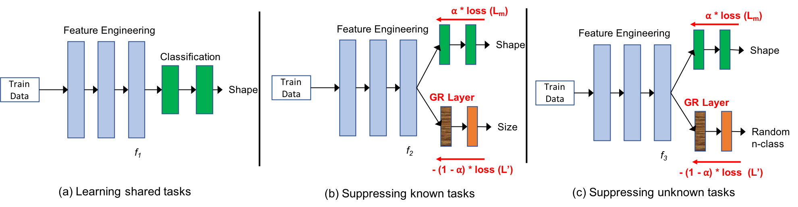
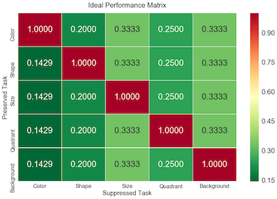
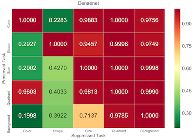

# [ICLR-2020](https://openreview.net/forum?id=B1lf4yBYPr)

This repository contains the original implementation of the paper - **[Is my deep learning model learning more than I want it to?](https://openreview.net/forum?id=B1lf4yBYPr)**.

## Introduction

1. Generate synthetic dataset (Can skip this with custom dataset)
2. Train a deep learning model for one task (currently training DenseNet model, can replace this with custom DL model)
3. Extract features of dataset on the DL model (can chose any custom layer)
4. Train neural network classifier model for other auxillary tasks (can replace this with custom classifier)
5. Computer Model trust score

Overall Input:
 - **Image data**: (N, h, w, 3) where 'N' is the number of images, 'hxw' is the dimension of each image
 - **Image label**: (N, m) where 'm' is the number of tasks performed using the same image - m_1 can be a 3-class classification task, m_2 maybe a 7-class classification task etc. One of the 'm' is a primary task and the rest of the 'm' becomes auxillary tasks.
 - **DL model**: 'keras' or 'tf.keras' compatible DL model object (trained or vanilla). The DL model is trained on the primary task.

Overall Output:
 - **Trust score**: [0-1], on how much the input DL model performs trustworthy learning on the input image data


Approach: 


## Dependencies
This code requires Keras 2+ and works in Python 3.6+


## Quick Start


### Install Prerequisites

```
$ git clone https://github.com/dl-model-recommend/model-trust.git

$ cd model-trust

$ pip install -r requirements.txt
```

### Run the entire code

```
$ python main.py
```

There are four primary paramter files for customization:
 - `make_dataset/dataset_params.py`
 - `train_DL_model/model_params.py`
 - `train_classifier_model/classification_params.py`
 - `compute_model_trust/trust_params.py`

## Results for DenseNet model

        

DenseNet Trust Score: `0.7572`

## Questions/Bugs

Please submit a Github issue if you have any questions or find any bugs.

## Citation

Please cite our paper using following BibTeX
```
@inproceedings{
anonymous2020is,
title={Is my Deep Learning Model Learning more than I want it to?},
author={Anonymous},
booktitle={Submitted to International Conference on Learning Representations},
year={2020},
url={https://openreview.net/forum?id=B1lf4yBYPr},
note={under review}
}
```
