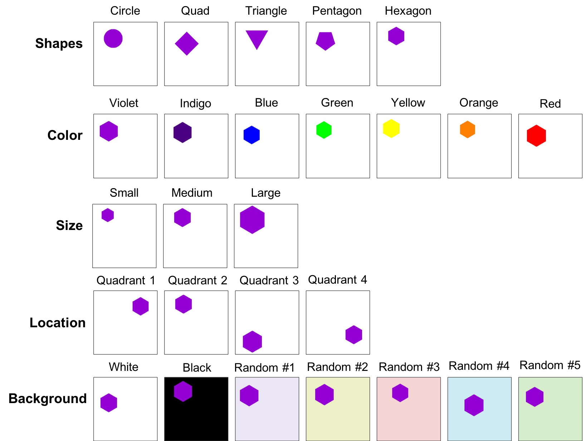

# [ICLR-2020](https://openreview.net/forum?id=B1lf4yBYPr)

This repository contains the original implementation of the paper - **[Is my deep learning model learning more than I want it to?](https://openreview.net/forum?id=B1lf4yBYPr)**.

## Generate Dataset

 - This is `Step 1` in the overall pipeline.
 - Generate synthetic dataset (Can skip this with custom dataset)

### Install Prerequisites

```
$ git clone https://github.com/dl-model-recommend/model-trust.git

$ cd model-trust

$ pip install -r requirements.txt
```

### Run the entire code

```
$ cd make_dataset
$ python make_dataset.py
```
The paramters are available for customization:
 - `make_dataset/dataset_params.py`


## Overall Output:
 - **Image data**: (N, h, w, 3) where 'N' is the number of images, 'hxw' is the dimension of each image
 - **Image label**: (N, m) where 'm' is the number of tasks performed using the same image - m_1 can be a 3-class classification task, m_2 maybe a 7-class classification task etc. One of the 'm' is a primary task and the rest of the 'm' becomes auxillary tasks.

Task #1 - Shape Classification (5 classes)
```
shapes = {
	"circle": 0,
	"quadrilateral": 1,
	"triangle": 2,
	"pentagon": 3,
	"hexagon": 4
}
```

Task #2 - Shape Color Classification (7 classes)
```
colors = {
	"violet": 0,
	"indigo": 1,
	"blue": 2,
	"green": 3,
	"yellow": 4,
	"orange": 5,
	"red": 6
}
```

Task #3 - Size Classification (3 classes)
```
sizes = {
	"small": 0,
	"medium": 1,
	"large": 2
}
```

Task #4 - Background Color Classification (3 classes)
```
backgrounds = {
	"white": 0,
	"black": 1,
	"random": 2
}
```

Task #5 - Quadrant Location Classification (4 classes)
```
quadrants = {
	"upper_right": 0,
	"upper_left": 1,
	"bottom_left": 2,
    "bottom_right": 3
}
```

## Sample Images



## Questions/Bugs

Please submit a Github issue if you have any questions or find any bugs.